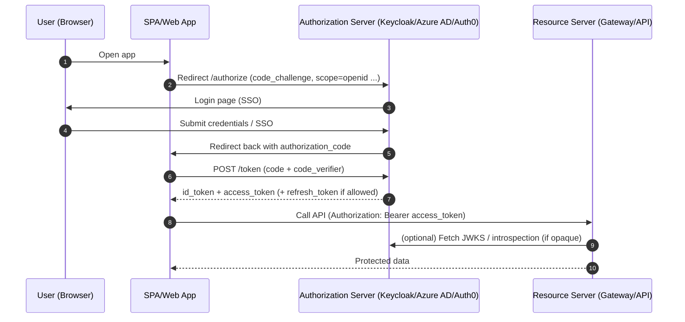
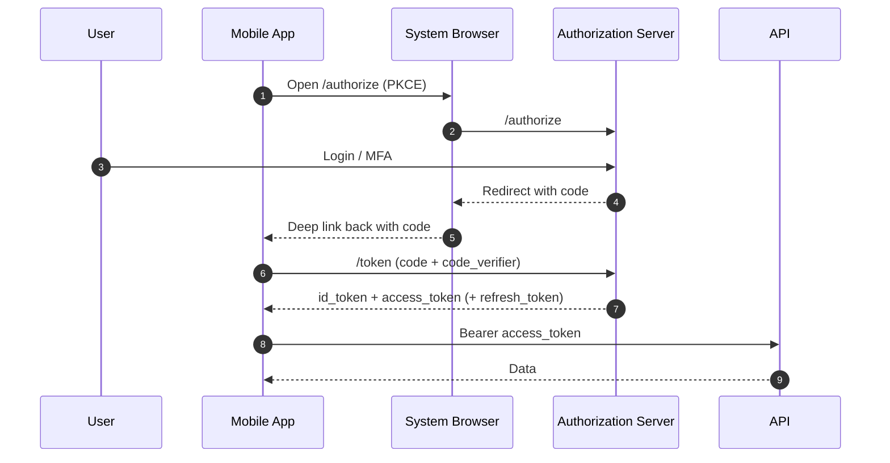
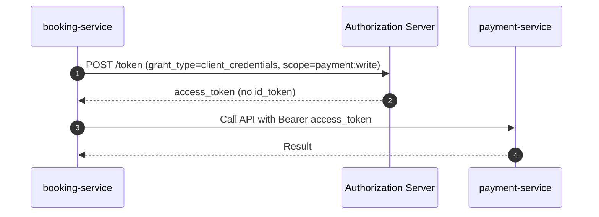
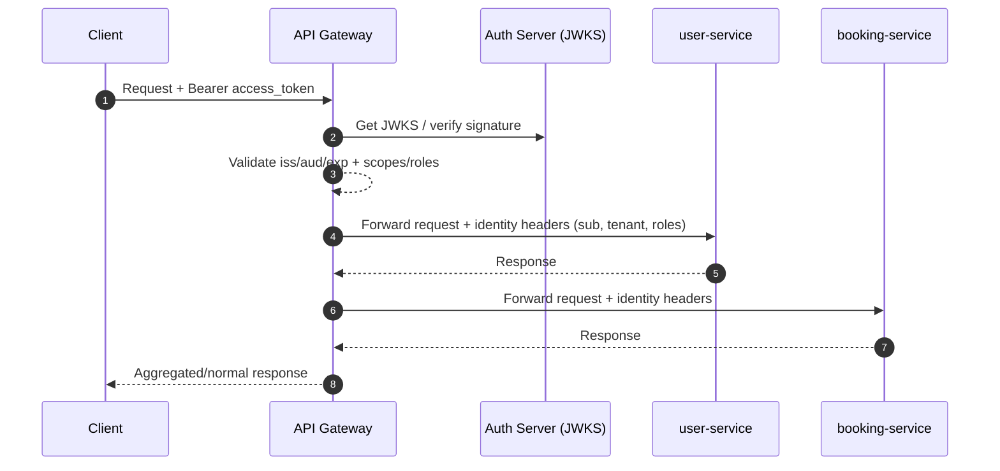

Dưới đây là 4 phần bạn yêu cầu, theo hướng **thực chiến microservices + Keycloak/Gateway**, kèm **sequence diagram (Mermaid)**.

---

# 1) Sequence diagram OAuth2/OIDC (các flow hay gặp)

## 1.1 SPA/Web + Backend: Authorization Code + PKCE (khuyến nghị)

**Ý nghĩa token:**

* `id_token`: chứng minh “user đã đăng nhập là ai” (dùng cho UI/session phía client)
* `access_token`: dùng gọi API
* `refresh_token`: đổi access token mới (nếu dùng)

---

## 1.2 Mobile App: Authorization Code + PKCE (tương tự SPA, thêm system browser)

---

## 1.3 Service-to-Service: Client Credentials (không có user)

---

## 1.4 Gateway verify token, propagate identity xuống services

> Lưu ý: “identity headers” chỉ nên dùng **nội bộ**, và vẫn nên có chiến lược để service tự verify khi cần (phần best practice bên dưới).

---

# 2) So sánh Keycloak vs Auth0 vs Azure AD (Entra ID)

## 2.1 Tổng quan nhanh

| Tiêu chí                      | Keycloak                         | Auth0                      | Azure AD (Microsoft Entra ID)    |
| ----------------------------- | -------------------------------- | -------------------------- | -------------------------------- |
| Loại                          | Self-host / managed (qua vendor) | SaaS Identity-as-a-Service | Enterprise IdP / SaaS            |
| Time-to-market                | Trung bình                       | Nhanh nhất                 | Nhanh (nếu đã dùng MS ecosystem) |
| Chi phí                       | Hạ tầng + vận hành               | Trả theo MAU/feature       | Theo tenant/license              |
| Tùy biến luồng login          | Mạnh (themes, flows)             | Mạnh (actions/rules)       | Mạnh nhưng enterprise-centric    |
| Federation (Google, FB, SAML) | Tốt                              | Rất tốt                    | Rất tốt (enterprise SSO)         |
| Multi-tenant (SaaS app)       | Làm được (realm/tenant design)   | Làm được dễ                | Làm được tốt trong MS ecosystem  |
| Ops/HA                        | Bạn tự lo                        | Vendor lo                  | Vendor lo                        |
| Fit cho microservices         | Rất hợp                          | Rất hợp                    | Rất hợp (nhất là MS)             |

## 2.2 Khi nào chọn cái nào?

**Chọn Keycloak khi:**

* Bạn muốn **tự chủ**, on-prem, hoặc compliance/air-gapped
* Muốn **kiểm soát sâu**: realm/roles/mappers/flow, custom provider
* Bạn ok với việc vận hành (backup, HA, upgrade)

**Chọn Auth0 khi:**

* Muốn “**đăng nhập chạy ngay**”, ít ops nhất
* Cần social login + enterprise login nhanh
* Chấp nhận chi phí theo MAU và feature

**Chọn Azure AD/Entra ID khi:**

* Khách hàng/doanh nghiệp đã dùng Microsoft 365, AD, MFA/Conditional Access
* Cần enterprise SSO, quản trị người dùng theo tổ chức
* Muốn tích hợp sâu với Azure, App Registration, groups, policies

---

# 3) Áp dụng OIDC cho Spa Booking microservices (kiến trúc gợi ý)

Giả sử hệ của bạn gồm:

* `api-gateway`
* `spa-user-service` (profile, customer/staff)
* `booking-service` (appointments)
* `payment-service`
* `notification-service`

## 3.1 Auth boundary (khuyến nghị)

* **Auth Server**: Keycloak (Realm: `spa`)
* **Gateway**: verify JWT + enforce coarse-grain access
* **Service**: enforce fine-grain authorization theo business rule

### Luồng login

* Client (SPA/Mobile) dùng **Authorization Code + PKCE**
* Scope: `openid profile email`
* API access: thêm `scope` hoặc `roles`

## 3.2 Token content (claims) nên có cho Spa Booking

* `sub`: userId (global immutable)
* `realm_access.roles` hoặc `resource_access.<client>.roles`: role
* `tenant_id`: nếu multi-tenant (chuỗi hoặc UUID)
* `branch_id` / `spa_id`: nếu có chi nhánh
* `zoneinfo` / `locale`: optional
* `amr` / `acr`: nếu dùng MFA level (enterprise)

## 3.3 Authorization model gợi ý

* **Role-based** (thô): `CUSTOMER`, `STAFF`, `MANAGER`, `ADMIN`
* **Permission/scope** (mịn):

  * `booking:read`, `booking:write`, `schedule:manage`, `payment:refund`

### Mapping vào Keycloak

* Roles: realm roles hoặc client roles
* Scopes: client scopes (hoặc “permissions” do bạn định nghĩa) + mapper vào token

## 3.4 Service-to-service

* Nếu service gọi nhau:

  * **Option A (chuẩn enterprise):** dùng **client_credentials** giữa services
  * **Option B (user delegation):** propagate user token xuống (cẩn trọng)

Khuyến nghị:

* `booking-service -> payment-service`: **client_credentials** (`payment:charge`)
* `booking-service -> notification-service`: client_credentials (`notify:send`)

---

# 4) Best practice token cho Multi-tenant system

## 4.1 2 mô hình multi-tenant phổ biến

### Model 1: “Tenant trong claim”

* Token có `tenant_id`
* API filter dữ liệu theo `tenant_id`

✅ Ưu: 1 realm/client, đơn giản
⚠️ Nhược: phải cực kì kỷ luật ở data access layer

### Model 2: “Realm per tenant” (Keycloak)

* Mỗi tenant một realm (hoặc một client riêng)
* Token tách biệt theo issuer (`iss`)

✅ Ưu: isolate mạnh
⚠️ Nhược: vận hành phức tạp khi tenant nhiều

> Thực tế SaaS vừa và lớn thường bắt đầu Model 1, sau đó chỉ “tách realm” cho tenant enterprise đặc biệt.

---

## 4.2 Token design best practices

**1) Access token ngắn hạn**

* 5–15 phút là phổ biến

**2) Refresh token rotation**

* Luôn rotate, detect reuse (chống token theft)

**3) “audience” rõ ràng**

* `aud` nên trỏ đúng API/Gateway
* Tránh token dùng được cho mọi service nếu không cần

**4) Claims tối giản**

* Token không phải DB. Chỉ để:

  * identity (`sub`)
  * authorization hints (roles/scopes)
  * tenant routing (`tenant_id`, `branch_id`)

**5) Không nhét PII nhạy cảm**

* Tránh full address/phone nếu không thật cần
* Nếu cần profile → gọi `user-service` hoặc `/userinfo`

**6) Fine-grain authorization ở service**

* Gateway check scope/role cơ bản
* Service check business rule:

  * customer chỉ sửa booking của chính họ
  * staff chỉ thao tác trong `branch_id` của họ
  * manager xem báo cáo toàn tenant

**7) Cơ chế “token version / session revoke”**

* Nếu cần revoke nhanh (logout tất cả thiết bị, khóa user):

  * thêm `token_version` claim và check với cache/DB
  * hoặc dùng introspection/“backchannel logout” tùy nền tảng

---

## 4.3 Pattern “Tenant isolation” ở data layer (rất quan trọng)

* Luôn inject `tenant_id` từ token vào:

  * DB query filter (where tenant_id = ?)
  * row-level security (nếu dùng Postgres RLS)
  * hoặc schema-per-tenant (tuỳ chiến lược)

> Nếu bạn dùng SQL Server/Azure SQL: rất thường thấy pattern `TenantId` column + filtered index + bắt buộc có trong mọi query.

---

Nếu bạn muốn mình “đóng gói” thành **bộ tài liệu triển khai** cho Phase 0 của Spa Booking (Keycloak + Gateway + User Service) theo đúng style bạn hay làm (checklist + file tree + config snippets), mình có thể viết luôn theo stack bạn đang dùng (Spring Cloud Gateway / NestJS / Java microservices, tuỳ bạn).
