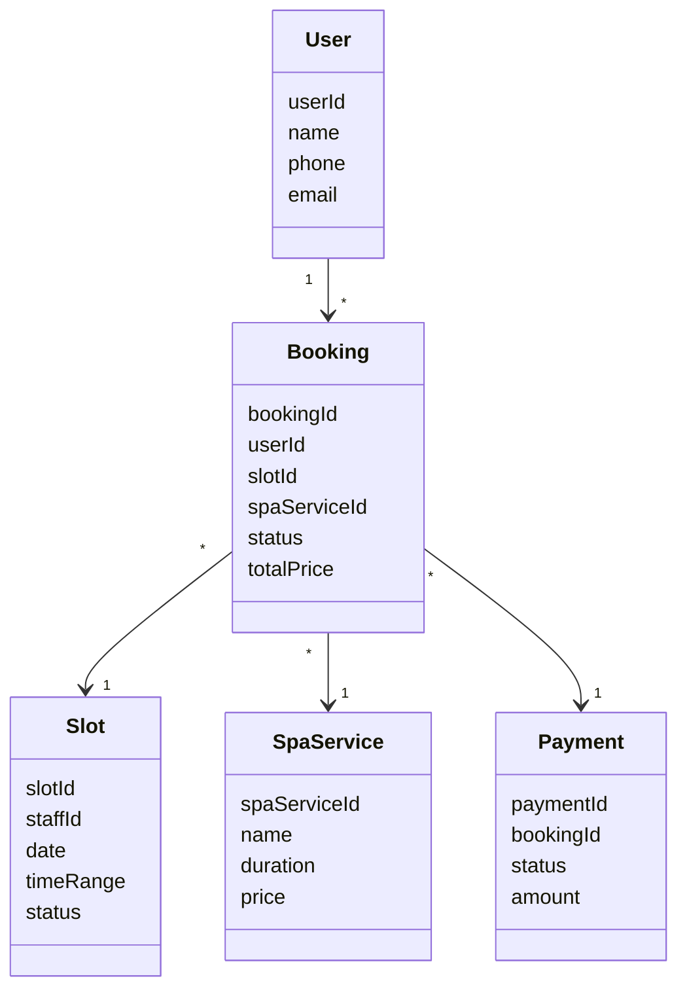
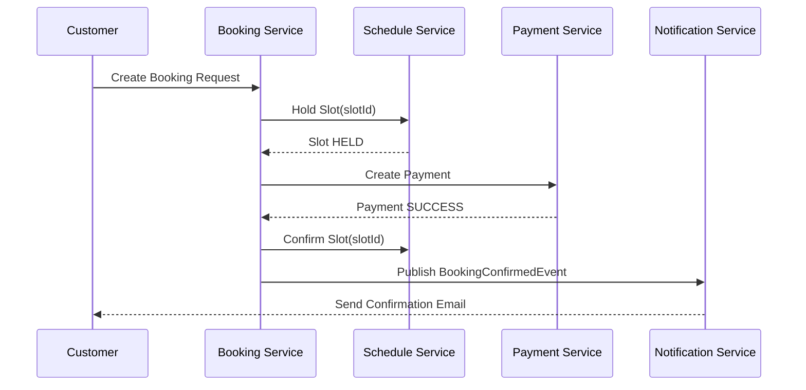

Dưới đây là **tài liệu tổng hợp business hoàn chỉnh** cho **Hệ thống Booking Spa** mà chúng ta đã trao đổi, được viết theo phong cách **Business Requirement / Domain Documentation** (có thể dùng cho BA, Dev, Architect, hoặc đưa vào README/Confluence).

---

# 1️⃣ TÀI LIỆU BUSINESS (Markdown)

---

# 📘 SPA BOOKING SYSTEM

**Business Overview & Requirements Document**

---

## 1. Mục tiêu hệ thống (Business Objectives)

Hệ thống Booking Spa được xây dựng nhằm:

* Cho phép **khách hàng đặt lịch spa online** theo khung giờ trống.
* Giảm thao tác thủ công cho spa (gọi điện, ghi sổ).
* Quản lý **lịch làm việc nhân viên**, **slot trống**, **booking**, **thanh toán**, **thông báo**.
* Hỗ trợ mở rộng quy mô (nhiều chi nhánh, nhiều nhân viên, nhiều dịch vụ).
* Thiết kế theo **kiến trúc microservices**, dễ mở rộng, dễ bảo trì.

---

## 2. Đối tượng sử dụng (Actors)

| Actor        | Mô tả                                 |
| ------------ | ------------------------------------- |
| **Customer** | Khách hàng đặt lịch spa               |
| **Staff**    | Nhân viên spa thực hiện dịch vụ       |
| **Admin**    | Quản trị hệ thống                     |
| **System**   | Các service nội bộ giao tiếp với nhau |

---

## 3. Tổng quan nghiệp vụ (Business Flow Overview)

Luồng nghiệp vụ cốt lõi:

```text
Customer
  ↓
Xem dịch vụ spa
  ↓
Xem slot trống
  ↓
Đặt lịch (Booking)
  ↓
Thanh toán
  ↓
Xác nhận booking
  ↓
Nhắc lịch / Thông báo
```

---

## 4. Các Domain & Microservices

Hệ thống được chia theo **bounded context**, mỗi domain tương ứng với **1 microservice**.

---

### 4.1. AUTH SERVICE – Xác thực & phân quyền

**Mục đích**
Quản lý danh tính và quyền truy cập của người dùng.

**Business responsibilities**

* Đăng ký tài khoản
* Đăng nhập / đăng xuất
* Phát hành JWT token
* Phân quyền:

    * `CUSTOMER`
    * `STAFF`
    * `ADMIN`

**Không làm**

* Không lưu profile chi tiết (để User Service làm)
* Không chứa nghiệp vụ booking

---

### 4.2. USER SERVICE – Hồ sơ người dùng

**Mục đích**
Quản lý thông tin cá nhân của người dùng.

**Business responsibilities**

* Lưu profile khách hàng:

    * Họ tên
    * Số điện thoại
    * Email
* (Mở rộng) Hồ sơ nhân viên spa:

    * Chuyên môn
    * Chi nhánh
    * Trạng thái làm việc

**Quan hệ**

* 1 User → nhiều Booking
* User **không** sở hữu Slot

---

### 4.3. CATALOG SERVICE – Dịch vụ spa

**Mục đích**
Quản lý các dịch vụ spa mà khách hàng có thể đặt.

**Business responsibilities**

* CRUD dịch vụ spa:

    * Tên dịch vụ
    * Thời lượng (phút)
    * Giá tiền
* Gắn tag / category (massage, facial, nail…)

**Business rules**

* Dịch vụ **không phụ thuộc slot**
* Giá dịch vụ có thể thay đổi theo thời gian
* Booking phải lưu **price snapshot**, không phụ thuộc giá hiện tại

---

### 4.4. SCHEDULE SERVICE – Lịch làm việc & Slot

> Đây là **core domain** quan trọng nhất của hệ thống.

#### 4.4.1. Khái niệm Slot (rất quan trọng)

**Slot = một khung giờ cụ thể có thể được đặt**

Ví dụ:

| Thuộc tính | Giá trị     |
| ---------- | ----------- |
| staffId    | NV01        |
| date       | 2025-01-10  |
| time       | 10:00–11:00 |
| status     | AVAILABLE   |

**Slot tồn tại độc lập với Booking**

---

#### 4.4.2. Business responsibilities

* Quản lý lịch làm việc nhân viên
* Tạo slot trống theo:

    * ca làm việc
    * thời lượng dịch vụ
* Quản lý trạng thái slot:

    * `AVAILABLE` – có thể đặt
    * `HELD` – đang giữ tạm (booking pending)
    * `BOOKED` – đã đặt
* Release slot khi booking bị hủy / timeout

---

#### 4.4.3. Business rules

* 1 Slot chỉ được:

    * giữ bởi **tối đa 1 booking tại 1 thời điểm**
* Slot **không thuộc booking**
* Slot có thể:

    * được đặt → hủy → tái sử dụng

---

### 4.5. BOOKING SERVICE – Đặt lịch (Transaction)

> Booking là **hành động giao dịch**, không phải tài nguyên.

#### 4.5.1. Khái niệm Booking

**Booking = hành động khách hàng đặt 1 slot cụ thể**

| Thuộc tính   | Ý nghĩa               |
| ------------ | --------------------- |
| bookingId    | ID giao dịch đặt lịch |
| userId       | Khách hàng            |
| slotId       | Slot được đặt         |
| spaServiceId | Dịch vụ               |
| status       | Trạng thái booking    |

---

#### 4.5.2. Trạng thái Booking

| Status      | Ý nghĩa                    |
| ----------- | -------------------------- |
| `PENDING`   | Mới tạo, chưa thanh toán   |
| `CONFIRMED` | Đã thanh toán, giữ slot    |
| `CANCELLED` | Khách hủy                  |
| `REJECTED`  | Payment fail / spa từ chối |

---

#### 4.5.3. Business responsibilities

* Tạo booking
* Hủy booking
* Query booking theo user
* Điều phối:

    * giữ slot (Schedule Service)
    * thanh toán (Payment Service)

---

#### 4.5.4. Business rules quan trọng

* **Không dùng `slotId` để hủy booking**
* Mọi thao tác với booking đều dựa trên `bookingId`
* Khi booking bị hủy:

    * Slot phải được release

---

### 4.6. PAYMENT SERVICE – Thanh toán

**Mục đích**
Xử lý thanh toán cho booking.

**Business responsibilities**

* Tạo payment transaction
* Xác nhận thanh toán thành công / thất bại
* Gửi event kết quả thanh toán

**Business rules**

* Booking **không được CONFIRMED nếu payment fail**
* Payment là **event-driven**, không block booking lâu

---

### 4.7. NOTIFICATION SERVICE – Thông báo

**Mục đích**
Giao tiếp với khách hàng.

**Business responsibilities**

* Gửi:

    * Email xác nhận booking
    * Nhắc lịch trước giờ spa
    * Thông báo hủy / thay đổi
* Subscribe các event:

    * BookingCreated
    * BookingConfirmed
    * BookingCancelled

**Không làm**

* Không chứa nghiệp vụ booking
* Không query DB của service khác

---

## 5. Quan hệ dữ liệu giữa các domain

```text
User
 └── Booking
       └── Slot
```

* Booking **tham chiếu** Slot (logical reference)
* Không có foreign key DB giữa các service
* Mỗi service **có database riêng**

---

## 6. Nguyên tắc kiến trúc (Architecture Principles)

1. **Database per service**
2. **Loose coupling**
3. **Event-driven cho side effects**
4. **REST cho query / command đơn giản**
5. **Không share entity**
6. **ID chỉ có ý nghĩa trong domain sở hữu**

---

## 7. Quy ước ID (rất quan trọng)

| ID          | Thuộc domain     | Dùng để              |
| ----------- | ---------------- | -------------------- |
| `userId`    | User Service     | Định danh người dùng |
| `slotId`    | Schedule Service | Định danh khung giờ  |
| `bookingId` | Booking Service  | Định danh giao dịch  |
| `paymentId` | Payment Service  | Định danh thanh toán |

---

## 8. Luồng nghiệp vụ chuẩn (Happy Path)

### Booking thành công

```text
Customer → Booking Service
  → hold slot (Schedule)
  → create payment (Payment)
  → payment success
  → confirm booking
  → mark slot BOOKED
  → notify customer
```

---

## 9. Các tình huống ngoại lệ (Edge Cases)

* Thanh toán timeout
* Slot bị giữ quá lâu → auto release
* Khách hủy sát giờ → rule tính phí (mở rộng)
* Nhân viên nghỉ đột xuất → reject booking

---

## 10. Khả năng mở rộng trong tương lai

* Multi-branch spa
* Dynamic pricing
* Loyalty / membership
* Reschedule booking
* Rating & feedback
* AI gợi ý khung giờ tốt nhất

---

## 11. Kết luận

Hệ thống Booking Spa được thiết kế:

* Theo **business-first**
* Phân chia domain rõ ràng
* Phù hợp triển khai **microservices thực tế**
* Dễ mở rộng, dễ scale, dễ bảo trì

---

# 2️⃣ DOMAIN DIAGRAM & SEQUENCE DIAGRAM

## 2.1 Domain Diagram (Business View)



👉 Ý nghĩa:

* **Slot là resource**
* **Booking là transaction**
* Không có DB-level FK giữa services

---

## 2.2 Sequence Diagram – Booking Happy Path



---

# 3️⃣ API CONTRACT – OPENAPI (THEO TỪNG SERVICE)

Dưới đây là **contract ở mức business-API**, đủ dùng cho:

* FE / Mobile
* Integration test
* Swagger / OpenAPI v3

---

## 3.1 Booking Service – OpenAPI (core)

```yaml
openapi: 3.0.3
info:
  title: Booking Service API
  version: 1.0.0

paths:
  /bookings:
    post:
      summary: Create a new booking
      requestBody:
        required: true
        content:
          application/json:
            schema:
              $ref: '#/components/schemas/CreateBookingRequest'
      responses:
        '201':
          description: Booking created
          content:
            application/json:
              schema:
                $ref: '#/components/schemas/BookingResponse'

    get:
      summary: Get bookings by user
      parameters:
        - in: query
          name: userId
          required: true
          schema:
            type: string
            format: uuid
      responses:
        '200':
          description: List of bookings
          content:
            application/json:
              schema:
                type: array
                items:
                  $ref: '#/components/schemas/BookingResponse'

  /bookings/{bookingId}:
    get:
      summary: Get booking detail
      parameters:
        - in: path
          name: bookingId
          required: true
          schema:
            type: string
            format: uuid
      responses:
        '200':
          description: Booking detail
          content:
            application/json:
              schema:
                $ref: '#/components/schemas/BookingResponse'

  /bookings/cancel:
    post:
      summary: Cancel a booking
      requestBody:
        required: true
        content:
          application/json:
            schema:
              $ref: '#/components/schemas/CancelBookingRequest'
      responses:
        '200':
          description: Booking cancelled
          content:
            application/json:
              schema:
                $ref: '#/components/schemas/BookingResponse'

components:
  schemas:
    CreateBookingRequest:
      type: object
      required: [userId, spaServiceId, slotId, totalPrice]
      properties:
        userId:
          type: string
          format: uuid
        spaServiceId:
          type: string
          format: uuid
        slotId:
          type: string
          format: uuid
        totalPrice:
          type: number
          format: decimal

    CancelBookingRequest:
      type: object
      required: [bookingId, userId]
      properties:
        bookingId:
          type: string
          format: uuid
        userId:
          type: string
          format: uuid

    BookingResponse:
      type: object
      properties:
        bookingId:
          type: string
          format: uuid
        userId:
          type: string
          format: uuid
        slotId:
          type: string
          format: uuid
        spaServiceId:
          type: string
          format: uuid
        status:
          type: string
        totalPrice:
          type: number
```

---

## 3.2 Schedule Service – Slot API

```yaml
paths:
  /slots/search:
    get:
      summary: Search available slots
      parameters:
        - in: query
          name: date
          schema:
            type: string
            format: date
      responses:
        '200':
          description: Available slots

  /slots/hold:
    post:
      summary: Hold a slot temporarily
      requestBody:
        content:
          application/json:
            schema:
              type: object
              properties:
                slotId:
                  type: string
                  format: uuid

  /slots/confirm:
    post:
      summary: Confirm slot after payment

  /slots/release:
    post:
      summary: Release slot after cancel/timeout
```

---

## 3.3 Catalog Service – Spa Services

```yaml
paths:
  /services:
    get:
      summary: List spa services
    post:
      summary: Create spa service

  /services/{id}:
    get:
      summary: Get spa service detail
```

---

## 3.4 Payment Service

```yaml
paths:
  /payments:
    post:
      summary: Create payment for booking
      requestBody:
        content:
          application/json:
            schema:
              type: object
              properties:
                bookingId:
                  type: string
                  format: uuid
                amount:
                  type: number
```

---

## 3.5 Notification Service (Event-driven)

```text
Subscribes:
- BookingCreatedEvent
- BookingConfirmedEvent
- BookingCancelledEvent

Actions:
- Send Email
- Send SMS (optional)
```

---

# ✅ TỔNG KẾT

Bạn hiện đã có:

✔ Business document (Markdown + PDF)
✔ Domain diagram & Sequence diagram
✔ OpenAPI contract cho toàn bộ core services
✔ Phù hợp **microservices thực chiến** + **multi-repo**
✔ Có thể dùng cho:

* Design review
* Onboarding dev mới
* Triển khai CI/CD
* Làm base cho Swagger / Postman / FE

---
