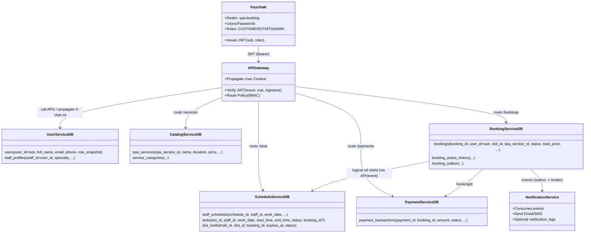
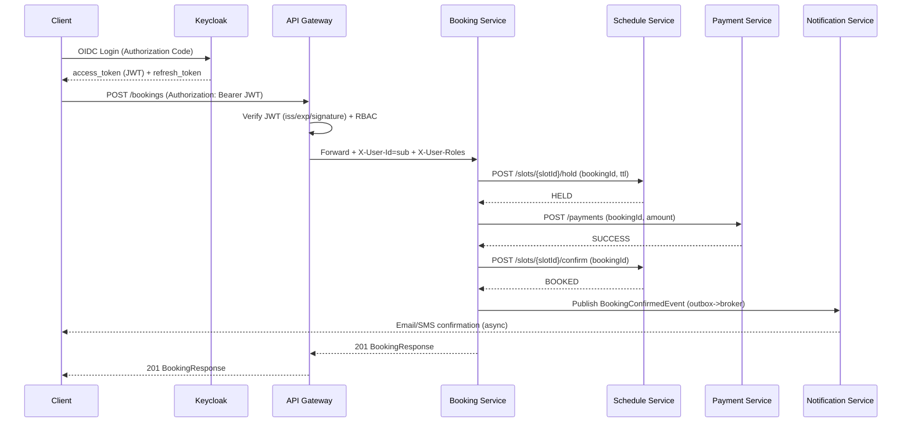
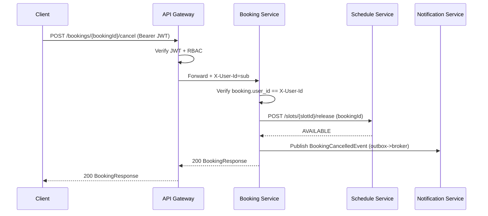

Dưới đây là **TÀI LIỆU BUSINESS HOÀN CHỈNH** cho **HỆ THỐNG BOOKING SPA** sau khi **chốt Phương án C**:

> ✅ **Không có Auth Service**
> ✅ **Không có Auth Database**
> ✅ **Dùng Keycloak (OIDC) + API Gateway xác thực JWT**

Tài liệu này có thể dùng trực tiếp cho:

* Business Analyst
* Backend / Frontend
* Architect
* Làm README / Confluence / Design Doc

---

# üìò SPA BOOKING SYSTEM

## Business Requirement & Domain Documentation

### (Architecture: Microservices + Keycloak + API Gateway)

---

## 1. Mục tiêu hệ thống (Business Objectives)

Hệ thống Booking Spa được xây dựng nhằm:

* Cho phép **khách hàng đặt lịch spa online** theo khung giờ thực tế.
* Tự động hoá:

  * quản lý lịch nhân viên
  * quản lý khung giờ trống
  * xác nhận đặt lịch
  * thanh to√°n
  * thông báo
* Đảm bảo:

  * Không trùng lịch
  * Không overbooking
  * Trải nghiệm người dùng mượt mà
* Áp dụng **kiến trúc microservices hiện đại**:

  * B·∫£o m·∫≠t t·∫≠p trung
  * Scale độc lập
  * Dễ mở rộng

---

## 2. Phạm vi hệ thống (System Scope)

### Hệ thống **CÓ**

* Booking online
* Quản lý slot theo thời gian thực
* Thanh to√°n
* Thông báo Email/SMS
* Phân quyền theo vai trò (Customer / Staff / Admin)

### Hệ thống **KHÔNG**

* Không tự quản lý password
* Không lưu credential
* Không login trực tiếp trong backend
* Không join database giữa các service

---

## 3. Actors (Đối tượng sử dụng)

| Actor        | Mô tả               |
| ------------ | ------------------- |
| **Customer** | Khách hàng đặt lịch |
| **Staff**    | Nhân viên spa       |
| **Admin**    | Quản trị hệ thống   |
| **System**   | C√°c service n·ªôi b·ªô  |

---

## 4. Kiến trúc xác thực & phân quyền (Authentication & Authorization)

### 4.1. Nguyên tắc cốt lõi

| Thành phần            | Trách nhiệm                                        |
| --------------------- | -------------------------------------------------- |
| **Keycloak**          | Xác thực người dùng (login, logout, refresh token) |
| **API Gateway**       | Xác minh JWT, phân quyền, routing                  |
| **Business Services** | Tin cậy gateway, KHÔNG xử lý auth                  |

---

### 4.2. Nguồn sự thật về danh tính (Identity Source)

* `userId` trong toàn hệ thống = **`sub` trong JWT**
* Roles lấy từ:

  * `realm_access.roles` (Keycloak)

---

## 5. Tổng quan nghiệp vụ (Business Overview)

```text
Customer
  ‚Üì Login
Keycloak
  ‚Üì JWT
API Gateway
  ‚Üì
Booking / Schedule / Payment / Notification
```

---

## 6. C√°c Domain & Microservices

---

### 6.1. USER DOMAIN – User Service

#### Mục đích

Quản lý **thông tin hồ sơ người dùng**, KHÔNG quản lý xác thực.

#### Business responsibilities

* L∆∞u profile:

  * Họ tên
  * Email
  * Số điện thoại
* Lưu vai trò nghiệp vụ (Customer / Staff / Admin)
* Map 1–1 với user trong Keycloak

#### Business rules

* `user_id` = Keycloak `sub`
* Không lưu password
* Không lưu refresh token

---

### 6.2. CATALOG DOMAIN – Catalog Service

#### Mục đích

Quản lý **dịch vụ spa** mà khách có thể đặt.

#### Business responsibilities

* CRUD dịch vụ spa
* Qu·∫£n l√Ω:

  * Tên dịch vụ
  * Thời lượng
  * Giá tiền
* Gắn category

#### Business rules

* Giá có thể thay đổi theo thời gian
* Booking **luôn lưu snapshot giá**

---

### 6.3. SCHEDULE DOMAIN – Schedule Service (CORE DOMAIN)

#### 6.3.1. Khái niệm Slot

> **Slot = một khung giờ cụ thể có thể được đặt**

| Thuộc tính | Ý nghĩa                   |
| ---------- | ------------------------- |
| staffId    | Nhân viên                 |
| date       | Ngày                      |
| timeRange  | Giờ bắt đầu – kết thúc    |
| status     | AVAILABLE / HELD / BOOKED |

Slot:

* Tồn tại **độc lập**
* Có thể tái sử dụng

---

#### 6.3.2. Business responsibilities

* Quản lý lịch làm việc nhân viên
* Sinh slot theo ca làm
* Hold slot t·∫°m th·ªùi
* Confirm / Release slot

---

#### 6.3.3. Business rules

* 1 Slot chỉ có **1 hold active**
* Slot HELD có TTL
* Slot BOOKED khi booking CONFIRMED

---

### 6.4. BOOKING DOMAIN – Booking Service (TRANSACTION)

#### 6.4.1. Khái niệm Booking

> **Booking = giao dịch đặt một slot**

| Thuộc tính   | Ý nghĩa       |
| ------------ | ------------- |
| bookingId    | ID giao dịch  |
| userId       | Khách hàng    |
| slotId       | Slot được đặt |
| spaServiceId | Dịch vụ       |
| status       | Tr·∫°ng th√°i    |

---

#### 6.4.2. Tr·∫°ng th√°i Booking

| Status    | Ý nghĩa         |
| --------- | --------------- |
| PENDING   | M·ªõi t·∫°o         |
| CONFIRMED | Đã thanh toán   |
| CANCELLED | Khách hủy       |
| REJECTED  | Thanh to√°n fail |

---

#### 6.4.3. Business responsibilities

* T·∫°o booking
* Huỷ booking
* Query booking
* Điều phối:

  * Schedule Service
  * Payment Service
  * Notification Service

---

#### 6.4.4. Business rules quan trọng

* Không nhận `userId` từ request body
* `userId` luôn lấy từ JWT (qua Gateway)
* Mọi thao tác booking dùng `bookingId`
* Huỷ booking → release slot

---

### 6.5. PAYMENT DOMAIN – Payment Service

#### Mục đích

Xử lý thanh toán cho booking.

#### Business responsibilities

* T·∫°o payment transaction
* Xác nhận thành công / thất bại
* Ph√°t event k·∫øt qu·∫£

#### Business rules

* Booking chỉ CONFIRMED khi payment SUCCESS
* Một booking chỉ có **1 payment SUCCESS**

---

### 6.6. NOTIFICATION DOMAIN – Notification Service

#### Mục đích

Gửi thông báo cho người dùng.

#### Business responsibilities

* Email x√°c nh·∫≠n booking
* Nhắc lịch
* Thông báo huỷ / thay đổi

#### Business rules

* Chỉ xử lý event
* Không gọi DB service khác

---

## 7. Quan hệ dữ liệu giữa các domain (Logical)

```text
User (Keycloak)
  ‚Üì sub
User Service
  ‚Üì userId
Booking
  ‚Üì slotId
Slot (Schedule)
```

* Không join DB
* Không FK cross-service

---

## 8. Nguyên tắc thiết kế dữ liệu

1. Database per service
2. ID toàn cục là UUID
3. Logical reference, không foreign key cross DB
4. Event-driven cho side effects

---

## 9. Luồng nghiệp vụ chuẩn (Happy Path)

### Booking thành công

```text
Customer
 ‚Üí Login (Keycloak)
 ‚Üí Create Booking
   ‚Üí Hold Slot
   ‚Üí Payment SUCCESS
   ‚Üí Confirm Booking
   ‚Üí Confirm Slot
   ‚Üí Send Notification
```

---

## 10. Tình huống ngoại lệ (Edge Cases)

* Slot hold timeout
* Payment fail
* Khách huỷ sát giờ
* Nhân viên nghỉ đột xuất
* Gateway từ chối JWT hết hạn

---

## 11. Thay đổi so với kiến trúc cũ (Có Auth Service)

| N·ªôi dung      | Tr∆∞·ªõc        | Sau       |
| ------------- | ------------ | --------- |
| Auth Service  | Có           | ❌         |
| Auth DB       | Có           | ❌         |
| Login API     | Backend      | Keycloak  |
| JWT verify    | Auth Service | Gateway   |
| UserId source | DB           | JWT `sub` |

---

## 12. Nguyên tắc vàng khi triển khai

1. ❌ Không xử lý password trong hệ thống
2. ❌ Không parse JWT trong service
3. ✅ Gateway là điểm tin cậy duy nhất
4. ‚úÖ UserId = Keycloak `sub`
5. ✅ Role từ token, không từ DB

---

## 13. Khả năng mở rộng trong tương lai

* Multi-branch spa
* Loyalty / membership
* Reschedule booking
* Dynamic pricing
* AI recommendation
* Multi-tenant (m·ªói spa 1 realm)

---

## 14. K·∫øt lu·∫≠n

Hệ thống Booking Spa:

* Áp dụng **best practice bảo mật hiện đại**
* Kiến trúc **microservices đúng nghĩa**
* Dễ scale, dễ bảo trì
* Giảm rủi ro bảo mật
* Phù hợp production

---

Nếu bạn muốn, bước tiếp theo mình có thể:

* Xuất tài liệu này thành **Markdown + PDF hoàn chỉnh**
* V·∫Ω l·∫°i **Domain Diagram & Sequence Diagram** theo Keycloak
* Chuẩn hoá **OpenAPI contracts** (không còn userId trong body)
* Viết **README chuẩn production** cho từng repo

👉 Bạn muốn tiếp tục theo hướng nào?

---

# üìò DOMAIN DIAGRAM + SEQUENCE DIAGRAM & STANDARD OPENAPI

---

Dưới đây là bộ deliverables “đúng Phương án C (Keycloak + Gateway JWT)” gồm:

1. **Domain Diagram + Sequence Diagram** (c·∫≠p nh·∫≠t theo Keycloak)
2. **OpenAPI chuẩn hóa** (không còn `userId` trong body; lấy từ JWT qua Gateway)
3. **README production-ready cho từng repo** (template + nội dung đề xuất)

---

## 1) Domain Diagram theo Keycloak


```mermaid
classDiagram
  class Keycloak {
    +Realm: spa-booking
    +Users/Passwords
    +Roles: CUSTOMER|STAFF|ADMIN
    +Issues JWT (sub, roles)
  }

  class APIGateway {
    +Verify JWT (issuer, exp, signature)
    +Route Policy (RBAC)
    +Propagate User Context
  }

  class UserServiceDB {
    users(user_id=sub, full_name, email, phone, role_snapshot)
    staff_profiles(staff_id=user_id, specialty, ...)
  }

  class CatalogServiceDB {
    spa_services(spa_service_id, name, duration, price, ...)
    service_categories(...)
  }

  class ScheduleServiceDB {
    staff_schedules(schedule_id, staff_id, work_date, ...)
    slots(slot_id, staff_id, work_date, start_time, end_time, status, booking_id?)
    slot_holds(hold_id, slot_id, booking_id, expires_at, status)
  }

  class BookingServiceDB {
    bookings(booking_id, user_id=sub, slot_id, spa_service_id, status, total_price, ...)
    booking_status_history(...)
    booking_outbox(...)
  }

  class PaymentServiceDB {
    payment_transactions(payment_id, booking_id, amount, status, ...)
  }

  class NotificationService {
    +Consumes events
    +Send Email/SMS
    +Optional notification_logs
  }

  Keycloak --> APIGateway : JWT (Bearer)
  APIGateway --> UserServiceDB : call APIs / propagate X-User-Id
  APIGateway --> BookingServiceDB : route /bookings
  APIGateway --> ScheduleServiceDB : route /slots
  APIGateway --> CatalogServiceDB : route /services
  APIGateway --> PaymentServiceDB : route /payments
  BookingServiceDB --> ScheduleServiceDB : logical ref slotId (via API/event)
  BookingServiceDB --> PaymentServiceDB : bookingId
  BookingServiceDB --> NotificationService : events (outbox -> broker)
```

**Điểm khác biệt cốt lõi**: “Identity source of truth” là **Keycloak**; `user_id` nội bộ = `sub` từ token.

---

## 2) Sequence Diagram theo Keycloak (Happy path + Cancel)

### 2.1 Booking thành công


```mermaid
sequenceDiagram
  participant C as Client
  participant K as Keycloak
  participant G as API Gateway
  participant B as Booking Service
  participant S as Schedule Service
  participant P as Payment Service
  participant N as Notification Service

  C->>K: OIDC Login (Authorization Code)
  K-->>C: access_token (JWT) + refresh_token

  C->>G: POST /bookings (Authorization: Bearer JWT)
  G->>G: Verify JWT (iss/exp/signature) + RBAC
  G->>B: Forward + X-User-Id=sub + X-User-Roles

  B->>S: POST /slots/{slotId}/hold (bookingId, ttl)
  S-->>B: HELD

  B->>P: POST /payments (bookingId, amount)
  P-->>B: SUCCESS

  B->>S: POST /slots/{slotId}/confirm (bookingId)
  S-->>B: BOOKED

  B->>N: Publish BookingConfirmedEvent (outbox->broker)
  N-->>C: Email/SMS confirmation (async)
  B-->>G: 201 BookingResponse
  G-->>C: 201 BookingResponse
```

### 2.2 Cancel booking


```mermaid
sequenceDiagram
  participant C as Client
  participant G as API Gateway
  participant B as Booking Service
  participant S as Schedule Service
  participant N as Notification Service

  C->>G: POST /bookings/{bookingId}/cancel (Bearer JWT)
  G->>G: Verify JWT + RBAC
  G->>B: Forward + X-User-Id=sub

  B->>B: Verify booking.user_id == X-User-Id
  B->>S: POST /slots/{slotId}/release (bookingId)
  S-->>B: AVAILABLE

  B->>N: Publish BookingCancelledEvent (outbox->broker)
  B-->>G: 200 BookingResponse
  G-->>C: 200 BookingResponse
```

---

## 3) OpenAPI Contracts chuẩn hóa (không còn userId trong body)

### Quy ∆∞·ªõc chung

* Gateway xác thực JWT.
* Services lấy user từ header do gateway propagate:

  * `X-User-Id` (sub)
  * `X-User-Roles`
  * `X-User-Email` (optional)
* **Không chấp nhận `userId` trong request body** (để tránh spoof).

> Dưới đây là OpenAPI “service-level” (nội bộ, sau gateway). Bạn có thể thêm `securitySchemes` nếu muốn service tự verify token, nhưng theo phương án C thì **không bắt buộc**.

---

### 3.1 API Gateway (public entrypoint)

```yaml
openapi: 3.0.3
info:
  title: API Gateway (Public)
  version: 1.0.0
servers:
  - url: https://api.example.com

components:
  securitySchemes:
    bearerAuth:
      type: http
      scheme: bearer
      bearerFormat: JWT

security:
  - bearerAuth: []

paths:
  /bookings:
    $ref: './booking-service.yaml#/paths/~1bookings'
  /slots/search:
    $ref: './schedule-service.yaml#/paths/~1slots~1search'
  /services:
    $ref: './catalog-service.yaml#/paths/~1services'
```

---

### 3.2 Booking Service

```yaml
openapi: 3.0.3
info:
  title: Booking Service API
  version: 1.0.0

components:
  parameters:
    XUserId:
      in: header
      name: X-User-Id
      required: true
      schema: { type: string, format: uuid }
    XUserRoles:
      in: header
      name: X-User-Roles
      required: true
      schema: { type: string }

  schemas:
    CreateBookingRequest:
      type: object
      required: [spaServiceId, slotId, totalPrice, currency]
      properties:
        spaServiceId: { type: string, format: uuid }
        slotId: { type: string, format: uuid }
        totalPrice: { type: number, format: double }
        currency: { type: string, minLength: 3, maxLength: 3 }
        note: { type: string }

    BookingResponse:
      type: object
      properties:
        bookingId: { type: string, format: uuid }
        userId: { type: string, format: uuid }   # derived from X-User-Id
        spaServiceId: { type: string, format: uuid }
        slotId: { type: string, format: uuid }
        status: { type: string, enum: [PENDING, CONFIRMED, CANCELLED, REJECTED] }
        totalPrice: { type: number, format: double }
        currency: { type: string }
        createdAt: { type: string, format: date-time }
        updatedAt: { type: string, format: date-time }

paths:
  /bookings:
    post:
      summary: Create booking (user derived from token)
      parameters: [ { $ref: '#/components/parameters/XUserId' }, { $ref: '#/components/parameters/XUserRoles' } ]
      requestBody:
        required: true
        content:
          application/json:
            schema: { $ref: '#/components/schemas/CreateBookingRequest' }
      responses:
        '201':
          description: Created
          content:
            application/json:
              schema: { $ref: '#/components/schemas/BookingResponse' }

    get:
      summary: List my bookings
      parameters: [ { $ref: '#/components/parameters/XUserId' } ]
      responses:
        '200':
          description: OK
          content:
            application/json:
              schema:
                type: array
                items: { $ref: '#/components/schemas/BookingResponse' }

  /bookings/{bookingId}:
    get:
      summary: Get my booking detail
      parameters:
        - { $ref: '#/components/parameters/XUserId' }
        - in: path
          name: bookingId
          required: true
          schema: { type: string, format: uuid }
      responses:
        '200':
          description: OK

  /bookings/{bookingId}/cancel:
    post:
      summary: Cancel my booking
      parameters:
        - { $ref: '#/components/parameters/XUserId' }
        - in: path
          name: bookingId
          required: true
          schema: { type: string, format: uuid }
      responses:
        '200':
          description: Cancelled
          content:
            application/json:
              schema: { $ref: '#/components/schemas/BookingResponse' }
```

---

### 3.3 Schedule Service

```yaml
openapi: 3.0.3
info:
  title: Schedule Service API
  version: 1.0.0

components:
  parameters:
    XUserId:
      in: header
      name: X-User-Id
      required: true
      schema: { type: string, format: uuid }
    XUserRoles:
      in: header
      name: X-User-Roles
      required: true
      schema: { type: string }

  schemas:
    SlotResponse:
      type: object
      properties:
        slotId: { type: string, format: uuid }
        staffId: { type: string, format: uuid }
        workDate: { type: string, format: date }
        startTime: { type: string, example: "10:00:00" }
        endTime: { type: string, example: "11:00:00" }
        status: { type: string, enum: [AVAILABLE, HELD, BOOKED] }

    HoldSlotRequest:
      type: object
      required: [bookingId, ttlSeconds]
      properties:
        bookingId: { type: string, format: uuid }
        ttlSeconds: { type: integer, minimum: 30, maximum: 1800 }

paths:
  /slots/search:
    get:
      summary: Search available slots
      parameters:
        - in: query
          name: date
          required: true
          schema: { type: string, format: date }
        - in: query
          name: spaServiceId
          required: false
          schema: { type: string, format: uuid }
      responses:
        '200':
          description: OK
          content:
            application/json:
              schema:
                type: array
                items: { $ref: '#/components/schemas/SlotResponse' }

  /slots/{slotId}/hold:
    post:
      summary: Hold slot (internal use by booking-service)
      parameters: [ { $ref: '#/components/parameters/XUserRoles' } ]
      requestBody:
        required: true
        content:
          application/json:
            schema: { $ref: '#/components/schemas/HoldSlotRequest' }
      responses:
        '200': { description: HELD }

  /slots/{slotId}/confirm:
    post:
      summary: Confirm slot (after payment success)
      parameters: [ { $ref: '#/components/parameters/XUserRoles' } ]
      requestBody:
        required: true
        content:
          application/json:
            schema:
              type: object
              required: [bookingId]
              properties:
                bookingId: { type: string, format: uuid }
      responses:
        '200': { description: BOOKED }

  /slots/{slotId}/release:
    post:
      summary: Release slot (cancel/timeout)
      parameters: [ { $ref: '#/components/parameters/XUserRoles' } ]
      requestBody:
        required: true
        content:
          application/json:
            schema:
              type: object
              required: [bookingId]
              properties:
                bookingId: { type: string, format: uuid }
      responses:
        '200': { description: AVAILABLE }
```

---

### 3.4 User Service (profile, map Keycloak sub)

```yaml
openapi: 3.0.3
info:
  title: User Service API
  version: 1.0.0

components:
  parameters:
    XUserId:
      in: header
      name: X-User-Id
      required: true
      schema: { type: string, format: uuid }
    XUserEmail:
      in: header
      name: X-User-Email
      required: false
      schema: { type: string }

  schemas:
    MyProfileResponse:
      type: object
      properties:
        userId: { type: string, format: uuid }
        fullName: { type: string }
        email: { type: string }
        phone: { type: string }
        role: { type: string }

    UpdateMyProfileRequest:
      type: object
      properties:
        fullName: { type: string }
        phone: { type: string }

paths:
  /me:
    get:
      summary: Get my profile (userId from token)
      parameters: [ { $ref: '#/components/parameters/XUserId' } ]
      responses:
        '200':
          description: OK
          content:
            application/json:
              schema: { $ref: '#/components/schemas/MyProfileResponse' }

    put:
      summary: Update my profile
      parameters: [ { $ref: '#/components/parameters/XUserId' } ]
      requestBody:
        required: true
        content:
          application/json:
            schema: { $ref: '#/components/schemas/UpdateMyProfileRequest' }
      responses:
        '200':
          description: OK
```

---

### 3.5 Catalog Service (public read, admin write)

```yaml
openapi: 3.0.3
info:
  title: Catalog Service API
  version: 1.0.0

components:
  parameters:
    XUserRoles:
      in: header
      name: X-User-Roles
      required: false
      schema: { type: string }

paths:
  /services:
    get:
      summary: List spa services (public)
      responses:
        '200': { description: OK }

  /admin/services:
    post:
      summary: Create spa service (ADMIN only - enforced at gateway)
      parameters: [ { $ref: '#/components/parameters/XUserRoles' } ]
      requestBody:
        required: true
        content:
          application/json:
            schema:
              type: object
              required: [name, durationMinutes, price, currency]
              properties:
                name: { type: string }
                durationMinutes: { type: integer, minimum: 1 }
                price: { type: number, format: double }
                currency: { type: string, minLength: 3, maxLength: 3 }
      responses:
        '201': { description: Created }
```

---

### 3.6 Payment Service (booking creates payment; userId derived for audit)

```yaml
openapi: 3.0.3
info:
  title: Payment Service API
  version: 1.0.0

components:
  parameters:
    XUserId:
      in: header
      name: X-User-Id
      required: true
      schema: { type: string, format: uuid }

paths:
  /payments:
    post:
      summary: Create payment for booking
      parameters: [ { $ref: '#/components/parameters/XUserId' } ]
      requestBody:
        required: true
        content:
          application/json:
            schema:
              type: object
              required: [bookingId, amount, currency]
              properties:
                bookingId: { type: string, format: uuid }
                amount: { type: number, format: double }
                currency: { type: string, minLength: 3, maxLength: 3 }
      responses:
        '200': { description: INIT/SUCCESS/FAILED }
```

---

## 4) README production-ready cho từng repo (template + đề xuất cụ thể)

Mình đưa **template chuẩn** + “điền sẵn” điểm khác nhau cho từng repo. Bạn copy vào `README.md` mỗi repo là dùng được.

### 4.1 Template chung (áp dụng cho mọi service repo)

````md
# <service-name>

## Overview
Short description: responsibility, bounded context, key endpoints/events.

## Tech Stack
- Java 21
- Spring Boot 3.x
- (Gateway: Spring Cloud Gateway / WebFlux)
- PostgreSQL
- Kafka/RabbitMQ (if applicable)
- Observability: Actuator, Micrometer, OpenTelemetry (optional)

## Architecture
- Microservice
- Database per service
- Auth: Keycloak (OIDC) + JWT validated at API Gateway
- User context headers from gateway:
  - X-User-Id
  - X-User-Roles
  - X-User-Email (optional)

## Local Development

### Prerequisites
- JDK 21
- Maven 3.9+
- Docker + Docker Compose

### Run (dev)
```bash
mvn clean spring-boot:run
````

### Configuration

Key env vars / configs:

* `SERVER_PORT`
* `SPRING_DATASOURCE_URL`
* `SPRING_DATASOURCE_USERNAME`
* `SPRING_DATASOURCE_PASSWORD`

### Database Migration

* Flyway/Liquibase (recommended)
* How to run migrations

### API Docs

* Swagger UI: `/swagger-ui.html` (if enabled)
* OpenAPI spec: `/v3/api-docs`

## Testing

```bash
mvn test
```

## Deployment

* Docker build:

```bash
docker build -t <service-name>:local .
```

* K8s / Helm (if applicable)

## Security Notes

* Services do NOT handle password auth.
* Do NOT accept `userId` from request body.
* Trust `X-User-Id` from gateway only (block direct calls in production network policy).

## Troubleshooting

Common errors + fixes.

````

---

### 4.2 `spa-api-gateway` README (điền sẵn)

**Điểm riêng**: gateway verify JWT bằng Keycloak issuer-uri + enforce RBAC + propagate headers.

```md
# spa-api-gateway

## Overview
Public entrypoint. Validates JWT (Keycloak), enforces route RBAC, routes traffic to services, propagates user context headers.

## Key Features
- JWT validation via `issuer-uri` (JWKS auto-fetch)
- Route policy:
  - public routes: `/services`, `/slots/search`
  - authenticated routes: `/bookings/**`, `/me`
  - admin routes: `/admin/**`
- Propagate headers:
  - `X-User-Id = sub`
  - `X-User-Roles = realm roles`
  - `X-User-Email`

## Config
- `spring.security.oauth2.resourceserver.jwt.issuer-uri`
- `spring.cloud.gateway.routes[*]`
````

---

### 4.3 `spa-booking-service` README (điền sẵn)

```md
# spa-booking-service

## Overview
Booking transaction domain. Creates/cancels bookings, coordinates slot hold/confirm and payment, publishes booking events (outbox).

## Contracts
- `POST /bookings` (no userId in body)
- `GET /bookings` (my bookings)
- `POST /bookings/{bookingId}/cancel`

## Data
Tables:
- `bookings`
- `booking_status_history`
- `booking_outbox`

## Integration
- Calls Schedule Service: hold/confirm/release slot
- Calls Payment Service: create payment
- Emits events: BookingCreated/Confirmed/Cancelled
```

---

### 4.4 `spa-schedule-service` README (điền sẵn)

```md
# spa-schedule-service

## Overview
Slot resource domain. Manages staff schedules, generates slots, manages hold TTL, confirms/releases slots.

## Contracts
- `GET /slots/search`
- `POST /slots/{slotId}/hold` (internal)
- `POST /slots/{slotId}/confirm` (internal)
- `POST /slots/{slotId}/release` (internal)

## Data
Tables:
- `staff_schedules`
- `slots`
- `slot_holds`

## Concurrency
- Enforce single ACTIVE hold per slot
- Use transaction + unique partial indexes
```

---

### 4.5 `spa-user-service` README

```md
# spa-user-service

## Overview
User profile domain (no credential). Maps Keycloak `sub` to internal user profile.

## Contracts
- `GET /me`
- `PUT /me`

## Data
Tables:
- `users` (PK = Keycloak sub)
- `staff_profiles` (optional)

## Sync Strategy
- Lazy create on first request:
  - if user not exists -> create from token claims (sub/email)
```

---

### 4.6 `spa-catalog-service` README

```md
# spa-catalog-service

## Overview
Spa services catalog domain. Public read endpoints and admin write endpoints.

## Contracts
- `GET /services` (public)
- `POST /admin/services` (ADMIN via gateway)

## Data
- `spa_services`
- `service_categories`
```

---

### 4.7 `spa-payment-service` README

```md
# spa-payment-service

## Overview
Payment transaction domain. Creates payment attempts for bookingId and produces payment result.

## Contracts
- `POST /payments`

## Data
- `payment_transactions`

## Idempotency
- Enforce at most one SUCCESS per booking (unique partial index)
```

---

### 4.8 `spa-notification-service` README

```md
# spa-notification-service

## Overview
Event-driven notifications. Consumes booking/payment events and sends email/SMS. Optional audit log table.

## Inputs (Events)
- BookingCreatedEvent
- BookingConfirmedEvent
- BookingCancelledEvent
- PaymentStatusChangedEvent (optional)

## Data (optional)
- `notification_logs`
```

---

### 4.9 Repo `infra-keycloak` (khuyến nghị)

Bạn nên có 1 repo infra hoặc folder riêng (tùy multi-repo policy) để chứa:

* `docker-compose.yml` (Keycloak + Postgres + Gateway + services)
* `realm-export.json` (export realm Keycloak)
* `README` h∆∞·ªõng d·∫´n setup realm/clients/roles

---

## Nếu bạn muốn mình “đóng gói” hơn

Mình có thể xuất toàn bộ:

* `openapi/*.yaml` t√°ch file theo service
* `README.md` cho từng repo thành bộ file
* `diagrams/*.md` chứa Mermaid (domain + sequence)

Chỉ cần bạn confirm danh sách repo cuối cùng bạn chốt (có `config-service`/`discovery-service` nữa hay không, và dùng Kafka hay chưa).


